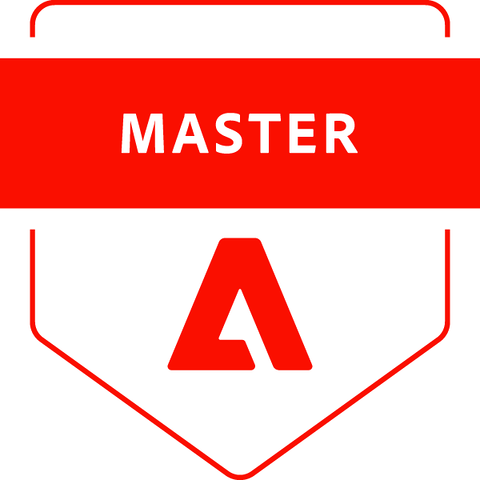

<!-- TODO: Add your cartoon avatar to assets/avatar.png — this image will show broken until the file exists -->

<h1></h1>

  

  

## About Me

Senior Solution Architect based in **Bratislava, Slovakia**. 12 years in enterprise integrations — 50+ projects delivered, 20+ systems connected, leading teams of 30+ engineers, tech leads, and QAs. Still shipping code daily.

I connect ERP, PIM, and commerce systems for enterprise B2B — manufacturing, wholesale, distribution, retail chains, healthcare. Complex catalogs, customer-specific pricing, multi-market deployments across 5+ countries. I make it work across **Adobe Commerce**, **Shopware 6**, and **Shopify**.

At [Atwix](https://github.com/Atwix) I lead integration architecture. On my own time I'm building **[Omnix](https://getomnix.dev)** — an agentic commerce middleware that connects any e-commerce store to any AI agent through the **Universal Commerce Protocol (UCP)**.

I write about integration architecture at [integration-maestro.com](https://integration-maestro.com).

---

## Currently

- **Architecting** a PHP-to-Node.js microservices migration (GraphQL Gateway -> full platform transition)
- **Integrating** MCP servers with Infor/Sirius ERP for B2B distribution
- **Learning** advanced GraphQL federation, Symfony 7, and distributed systems patterns

---

## Omnix Ecosystem

> Connect any commerce backend to any AI agent. [Learn about UCP ->](https://getomnix.dev)

  
  

  
  

  <a href="https://star-history.com/#OmnixHQ/omnix-gateway&Date">
    <picture>
      <source media="(prefers-color-scheme: dark)" srcset="https://api.star-history.com/svg?repos=OmnixHQ/omnix-gateway&type=Date&theme=dark" />
      <source media="(prefers-color-scheme: light)" srcset="https://api.star-history.com/svg?repos=OmnixHQ/omnix-gateway&type=Date" />
      
    </picture>
  </a>

---

## Adobe Commerce Certifications

The highest level in the Adobe certification program is **Adobe Subject Matter Expert — Adobe Commerce Architect Master**. To earn it, you first pass the **Adobe Certified Master — Adobe Commerce Architect** exam — a credential held by only ~40 people worldwide. I hold both, along with two Expert-level certifications.

| Badge | Credential | Verify |
|:-----:|-----------|:------:|
|  | **Adobe Subject Matter Expert — Adobe Commerce Architect Master** | [✓ Verify](https://certification.adobe.com/credential/verify/d73c5c04-d80d-11ef-9883-42010a40002a) |
|  | **Adobe Certified Master — Adobe Commerce Architect** | [✓ Verify](https://certification.adobe.com/credential/verify/bc671452-c50e-480f-8224-8607a03a264e) |
|  | **Adobe Certified Expert — Adobe Commerce Business Practitioner** | [✓ Verify](https://certification.adobe.com/credential/verify/c37ccfd3-4ae5-4421-adf8-e221e02d4846) |
|  | **Adobe Certified Expert — Adobe Commerce Developer** | [✓ Verify](https://certification.adobe.com/credential/verify/6bb79368-ad96-47d6-83a8-30240cc3ea4d) |

---

## Stack

**Languages & Frameworks**

**Commerce Platforms**

**Infrastructure & Tools**

---

## GitHub Analytics

 

 

<picture>
  <source media="(prefers-color-scheme: dark)" srcset="https://github-readme-activity-graph.vercel.app/graph?username=artemii-karkusha&days=90&bg_color=0d1117&color=8a8a8e&line=d4a843&point=e8e6e3&area=true&area_color=d4a843&hide_border=true&custom_title=Artemii%20Karkusha%27s%20Contribution%20Graph%20(90%20days)" />
  <source media="(prefers-color-scheme: light)" srcset="https://github-readme-activity-graph.vercel.app/graph?username=artemii-karkusha&days=90&bg_color=ffffff&color=333333&line=b8860b&point=333333&area=true&area_color=f5e6c8&hide_border=true&custom_title=Artemii%20Karkusha%27s%20Contribution%20Graph%20(90%20days)" />
  
</picture>

---

## Writing

I write about the hard parts of enterprise integration — the failures, the patterns, and the protocols.

- [A 2 AM Integration Failure That Changed How I Design Systems](https://integration-maestro.com/articles/a-2-am-integration-failure-changed-how-i-design-systems)
- [How Slow ERP Sync Silently Kills eCommerce Revenue](https://integration-maestro.com/articles/how-slow-erp-sync-silently-kills-ecommerce-revenue)
- [Idempotency: The #1 Rule of Safe Integrations Teams Ignore](https://integration-maestro.com/articles/idempotency-safe-integrations-rule)
- [REST vs SOAP vs GraphQL: Which Integration Protocol Wins in 2025?](https://integration-maestro.com/articles/rest-vs-soap-vs-graphql-which-integration-protocol-wins-in-2025)

---

## Track Record

<table>
<tr>
<td align="center" width="50%">

**Pipeline Optimization**

Redesigned a feed queue during Black Friday / Cyber Monday handling 75K users/min and 250M+ events

</td>
<td align="center" width="50%">

**Large-Scale Catalog Sync**

Built systems processing 1.5M product updates in a single cycle across multi-market B2B deployments

</td>
</tr>
<tr>
<td align="center" width="50%">

**High-Volume Integrations**

Thousands of orders/day with ERP, PIM, and commerce kept in sync across markets

</td>
<td align="center" width="50%">

**Protocol Design**

Designing UCP as the open standard for commerce-to-AI communication

</td>
</tr>
</table>

---

**Bratislava, Slovakia · [@Atwix](https://github.com/Atwix) · [Momentum Group s.r.o.](https://getomnix.dev)**

